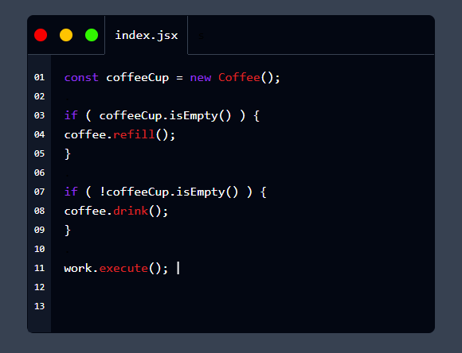

# Code Editor Animation Project

Welcome to the Code Editor Animation project! This project showcases an interactive and visually engaging code editor animation. You can see a live demo of this project at [Code Editor Animation Demo](https://code-editor-anime.vercel.app/).




# Getting started

1. install tailwindcss or use cdn
2. install typeIt js library using ```npm install typeit ```
3. copy and paste the codes inside **index.html** **input.css** and **main.js**

If you need help implementing this, I will be happy to help. Just contact me.

## Contact

- 📫 You can reach me via email at Sapumr@gmail.com
- Connect with me on Telegram: https://t.me/mhl_5

